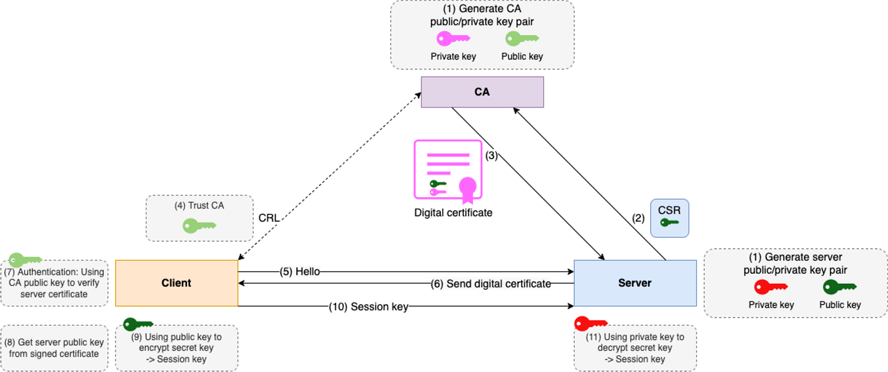
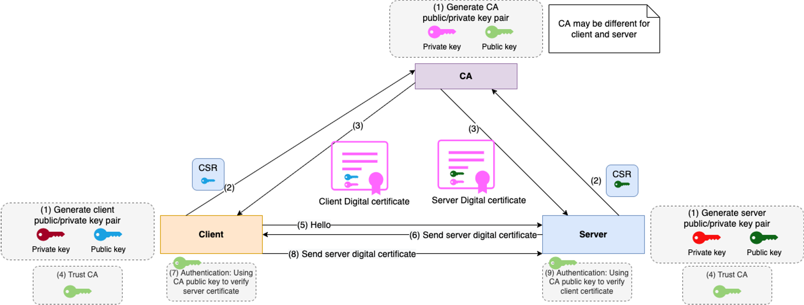

# spring-ssl-example
A sample SSL/TLS configuration with Spring Boot

What this example includes:
- Generate certificates: rootCA, server certificate, client certificate, keystore, truststore.
- Config SSL/TLS in Spring Boot Application Server.
- Config mTLS authentication in Spring Boot Application Server.
- Config SSL/TLS for Web Client to call a secure API using SSL certificates. 
- Config Trust CA and client certificates for Browsers.
- Using curl command to connect a secure API using SSL certificates.

Source code structure:
- [certs](certs): contains all certificates to config SSL/TLS. You can use these certificates or follow the steps below to generate your certificates
- [server](server): Spring Boot Application with Spring Security mTLS config
- [client](client): Spring Boot Application with Web Client HTTPS config

## Generate certificates



### 1. Self Signed Root CA

To be able to sign our server-side and client-side certificates, we need to create our own self-signed root CA certificate first. 
This way we'll act as our own certificate authority.

> openssl req -x509 -sha256 -days 3650 -newkey rsa:4096 -keyout rootCA.key -out rootCA.crt

+ Pwd: gp123
+ Country Name (2 letter code) []:VN
+ State or Province Name (full name) []:Can Tho
+ Locality Name (eg, city) []:
+ Organization Name (eg, company) []:gpcoder
+ Organizational Unit Name (eg, section) []:GP
+ Common Name (eg, fully qualified host name) []:gpcoder.com
+ Email Address []:rootca@gpcoder.com

Output: `rootCA.crt` and `rootCA.key`

### 2. Create Server-side Certificate

To implement the server-side X.509 authentication in our Spring Boot application, we need to create a server-side certificate.

#### Create certificate signing request (CSR)

> openssl req -new -newkey rsa:4096 -keyout localhost.key -out localhost.csr

+ Pwd: server123
+ Country Name (2 letter code) []:VN
+ State or Province Name (full name) []:Can Tho
+ Locality Name (eg, city) []:
+ Organization Name (eg, company) []:gpcoder
+ Organizational Unit Name (eg, section) []:GP
+ Common Name (eg, fully qualified host name) []:localhost
+ Email Address []:server.local@gpcoder.com
  
Output: `localhost.csr` and `localhost.key`

#### Create a configuration file – localhost.ext. 

It'll store some additional parameters needed during signing the certificate.

```
authorityKeyIdentifier=keyid,issuer
basicConstraints=CA:FALSE
subjectAltName=@alt_names
[alt_names]
DNS.1=localhost
```

#### Sign the request with our rootCA.crt certificate and its private key

> openssl x509 -sha256 -req -CA rootCA.crt -CAkey rootCA.key -in localhost.csr -out localhost.crt -days 365 -CAcreateserial -extfile localhost.ext

Output: `localhost.crt`

+ rootCa.key: gp123

#### View our certificate's details

> openssl x509 -in localhost.crt -text

### 3. Create Keystore

A keystore is a repository that our Spring Boot application will use to hold our server's private key and certificate. In other words, our application will use the keystore to serve the certificate to the clients during the SSL handshake.

We use the `Java Key-Store (JKS)` format for both key stores and trust stores.

The steps below show how to import the signed certificate and the corresponding private key to the keystore.jks file.

#### Create PFX file

Create a `.PFX` file which will be intern used to create the JKS file.

We'll use the PKCS12 format, to package our server's private key together with the signed certificate.

> openssl pkcs12 -export -out localhost.pfx -name "localhost" -inkey localhost.key -in localhost.crt

+ localhost.key: server123 - CSR's key
+ Export Pwd: pfx123

Output: `localhost.pfx`

#### Create JKS file

Use keytool to create a `keystore.jks` repository and import the `localhost.pfx` file with a single command:

> keytool -importkeystore -srckeystore localhost.pfx -srcstoretype PKCS12 -destkeystore keystore.jks -deststoretype JKS

+ Destination Pwd: serverkey123
+ Source Pwd: pfx123 - PFX's password

Output: `keystore.jks`

View the content of JKS file:

> keytool -v -list -keystore keystore.jks

## Config SSL/TLS in Spring Boot Application Server

- Refer SSL config: [application.properties](server/src/main/resources/application.properties)

- Test app:
    - Start application: at root folder, run command `./gradlew :bootRun`
    - Open Browser (Chrome)
    - Access `https://localhost:8443/server.api/v1/user`
    - Got the error: `Your connection is not private (NET::ERR_CERT_INVALID)`
    - This issue can be fixed by adding trusted CA.

- You can use curl command with ignore certificate param `--insecure`

```aidl

curl --location --request GET 'https://localhost:8443/server.api/v1/user' \
--header 'Authorization: Basic YWRtaW46YWRtaW4=' \
--insecure

```

## Trusted CA

We need to install our generated root certificate authority as a trusted certificate in a browser. 

### Chrome Browser on MacOS:

- Chrome -> Preferences -> Privacy and Security -> Security -> Manage certificates -> Keychain Access app will be opened
    * You can search app directly: Keychain Access
- In Keychain Access app -> File -> Import Items -> select our `rootCA.crt` file
- Select tab Certificates -> you can see our CA certificate have been imported successful -> Select certificate -> Get Info -> Trust -> "When using this certificate" -> Always Trust
- Access `https://localhost:8443/server.api/v1/user` -> You can see the response.

### Firefox Browser on MacOS:

- Firefox -> Preferences -> Privacy and Security -> Certificates -> View Certificates -> Authorities
- Import -> select our `rootCA.crt` file
- Choose “Trust this CA to identify websites” -> click OK
- Access `https://localhost:8443/server.api/v1/user` -> You can see the response.

## mTLS



### Create Truststore

A trustsore in some way is the opposite of a keystore. It holds the certificates of the external entities that we trust.
In this example, I want to keep the root CA certificate in the truststore.

> keytool -import -trustcacerts -noprompt -alias ca -ext san=dns:localhost,ip:127.0.0.1 -file rootCA.crt -keystore truststore.jks

+ pwd: trust123

Output: `keystore.jks`

View the content of JKS file:

> keytool -v -list -keystore keystore.jks

### Create client keystore

- Create CSR

> openssl req -new -newkey rsa:4096 -subj '/CN=client1' -keyout client.key -out client.csr

+ Pwd: client123

Output: `client.key` and `client.csr`

- Sign the request with our CA:
  
> openssl x509 -sha256 -req -CA rootCA.crt -CAkey rootCA.key -in client.csr -out client.crt -days 365 -CAcreateserial

+ CA pwd: gp123

Output: `client.crt`

- Create PKCS file

> openssl pkcs12 -export -out client.pfx -name "client1" -inkey client.key -in client.crt

+ client.key: client123
+ Export pwd: clientpfx123

Output: `client.pfx`

- Create JKS file

> keytool -importkeystore -srckeystore client.pfx -srcstoretype PKCS12 -destkeystore client.jks -deststoretype JKS

+ Destination Pwd: clientkey123
+ Source Pwd: clientpfx123 - PFX's password

Output: `client.jks`

View the content of JKS file:

> keytool -v -list -keystore client.jks

### Config mTLS in Spring Boot Application Server

Refer mTLS config: [application.properties](server/src/main/resources/application.properties)

#### Test app using `curl` command:

> curl --key client.key --cert client.crt https://localhost:8443/server.api/v1/user

#### Test app using Chrome Browser on MacOS:

- Chrome -> Preferences -> Privacy and Security -> Security -> Manage certificates -> Keychain Access app will be opened
  * You can search app directly: Keychain Access
- In Keychain Access app -> File -> Import Items -> select our `client.pfx` file
- Select tab My Certificates -> you can see our client certificate have been imported successful
- Access `https://localhost:8443/server.api/v1/user` -> Select the client certificate -> OK -> Enter your MacOS password -> You can see the response.

#### Test app using Firefox Browser on MacOS:

- Firefox -> Preferences -> Privacy and Security -> Certificates -> View Certificates -> Your Certificates
- Import -> select our `client.pfx` file -> Enter pfx password -> OK
- Access `https://localhost:8443/server.api/v1/user` -> Select the client certificate -> OK -> You can see the response.


## Config SSL/TLS for Web Client

Refer: 
- [SSL Config](client/src/main/resources/application.properties)
- [Web Client Config](client/src/main/java/com/gpcoder/springssl/config/WebClientConfig.java)

## IMPORTANT

In this example, I stored the password as plaintext in the source code, but you shouldn't do that in your products, use the Jasypt library to encrypt/decrypt it.
